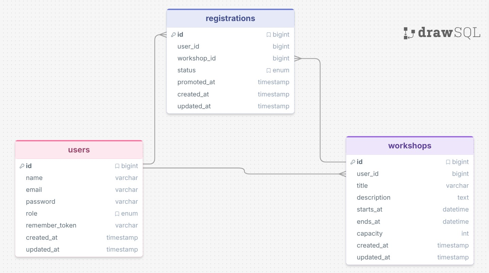

# Architecture Decisions

This document outlines the key architectural decisions made during the development of the Internal Academy platform, along with the rationale behind each choice.

---

## 1. Authentication via Laravel Vue Starter Kit

Authentication (login, logout, session management) is implemented using the official **Laravel Vue Starter Kit**.

**Why:** It is the current officially recommended starting point for Laravel applications with a Vue frontend and it is simple and complete enought for the scope of this project.

## 2. Database Schema and decisions

### Relationships

- A **User** can create many **Workshops** (admin only)
- A **User** can have many **Registrations**
- A **Workshop** can have many **Registrations**
- A **Registration** belongs to one **User** and one **Workshop**

### Notes on key design choices

- `starts_at` / `ends_at` instead of a single `date` field — needed for overlap detection
- `status` on `registrations` handles both confirmed seats and waiting list in a single table
- `created_at` on `registrations` drives FIFO promotion when a confirmed seat is freed
- `promoted_at` on `registrations` tracks when a waiting user was promoted — enables historical statistics (average wait time, promotion rate per workshop)
- `role` on `users` is a simple enum — no separate roles table needed at this scale
- soft deletes are used to keep historical data for workshops and registrations

## 3. CRUD conventions

### Form Requests
Each write operation has its own FormRequest (`StoreXRequest`, `ModifyXRequest`). Authorization via policy is always done inside `authorize()`, never in the controller.

### Date handling
- **Backend** (`prepareForValidation`): converts input dates to UTC before validation and storage.
- **Frontend** (`lib/date.ts`): responsible for all formatting — `toDatetimeLocal()` for inputs, `formatDateTime()` / `formatRange()` for display. The backend always sends raw ISO 8601 strings.

### Routing (Wayfinder)
Type-safe route helpers are auto-generated by Wayfinder. Never hardcode URLs in Vue components — always import from `@/routes/...`.

### Feature removal
When a feature is removed (e.g. registration), delete: the Vue page, all route references in other components, and the backend route/data that fed it. Leave no dead props or imports.

---

## 4. Role-based Authorization

Users are split into two roles: `admin` and `employee`. Each role has a dedicated back
office area with its own routes and dashboard.

### Routing

Two separate route groups in `web.php`, each protected by the `EnsureRole` middleware:

- `GET /admin/dashboard` → `Admin\DashboardController` — requires `role:admin`
- `GET /employee/dashboard` → `Employee\DashboardController` — requires `role:employee
`

### Centralized route resolution

`User::dashboardRoute()` on the model centralizes the role→URL mapping. All controller
s call this method instead of repeating the `match` on `role`, so adding a new role re
quires a single change.
